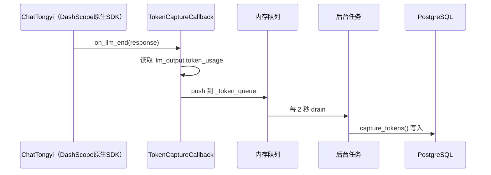
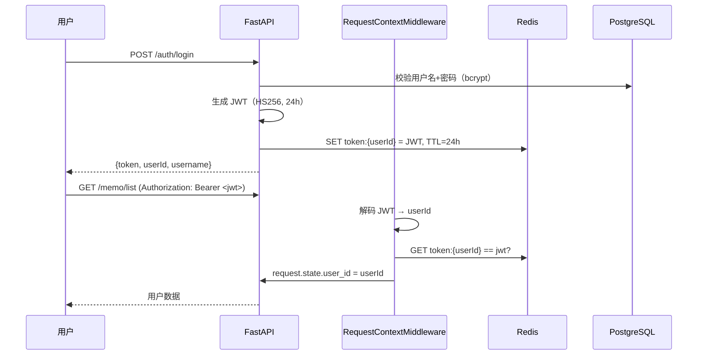
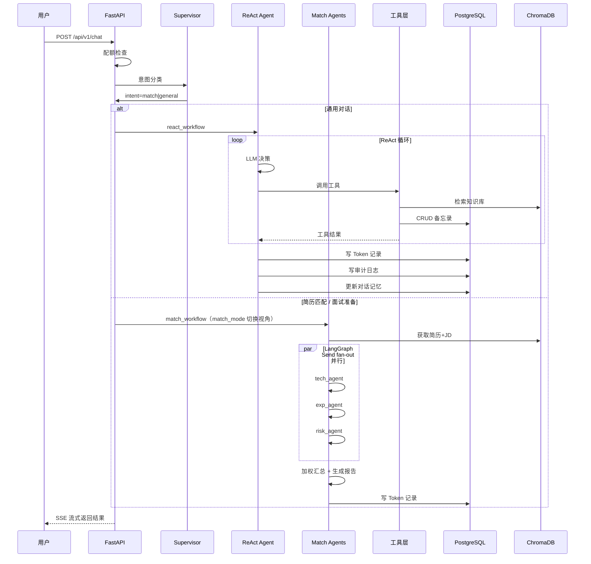

# 架构设计文档

## 为什么选择多智能体架构

### 架构对比

| 维度 | 单 Agent | 多 Agent | 纯工作流 |
|------|---------|---------|---------|
| 复杂度 | 低 | 中 | 中-高 |
| 并行能力 | 串行 | 独立并行 | 取决于设计 |
| 专业化 | 通用 Prompt | 每个 Agent 专用 Prompt | 每个步骤固定逻辑 |
| 可扩展性 | 改 Prompt | 加 Agent | 改流程 |
| 适用场景 | 通用对话 | 多维度评估 | 固定流程自动化 |

### 本项目选择

- **通用对话** → 单 Agent ReAct 模式：LLM 自主决策工具调用，灵活应对各种请求
- **简历匹配** → 多 Agent 并行：技术/经验/风险三个维度互不依赖，可并行评估

为什么不全部用多 Agent？
- 日常对话（查知识、记备忘、发邮件）不需要并行，单 Agent ReAct 足够
- 简历匹配的三个维度评估是独立的、无依赖的，并行化收益高

---

## 关键设计决策

### 1. 并行调用（LangGraph Send fan-out）

三个评估 Agent 输入相同（简历 + JD），输出独立（评分 + 理由），无状态依赖。使用 LangGraph `Send` API 做 fan-out 并行执行，总耗时 ≈ max(单个 Agent 耗时) 而非 sum。

```python
def _fanout_decision(state: AgentState) -> list[Send]:
    return [
        Send("tech_agent", state),
        Send("exp_agent", state),
        Send("risk_agent", state),
    ]
```

### 2. 双模式支持（招聘方 / 候选人视角）

Supervisor 通过自然语言自动识别模式：

| 模式 | 触发关键词 | 报告类型 |
|------|-----------|---------|
| recruiter | "评估候选人"、"匹配度" | 岗位匹配度评估报告 |
| candidate | "帮我分析"、"怎么准备"、"我适合吗" | 面试准备报告 |

两种模式共用同一条并行评估流水线，通过 `match_mode` 状态字段切换：
- **Prompt 不同**：招聘方用打分型 prompt，候选人用建议型 prompt
- **汇总不同**：`summarize_results()` vs `summarize_candidate_results()`
- **前端不变**：同一 SSE 端点流式输出

### 3. temperature=0

评分场景要求可重现性，所有评估 Agent 和 Supervisor 分类节点使用 `temperature=0`。通用对话 Agent 使用 `temperature=0.3` 保持一定创造性。

### 4. 加权策略（40/35/25）

- 技术匹配 40%：最重要的维度，直接影响工作胜任度
- 经验匹配 35%：项目经验反映实际工作能力
- 风险评估 25%：软性因素，作为补充参考

### 6. LangGraph 子图封装

简历匹配封装为独立 `StateGraph`，作为子图被 Supervisor 调用：
- 输入：`resume_filename` + `jd_text`
- 输出：`match_report` + `final_score`
- 可独立测试、独立部署、未来可扩展为独立服务

### 7. 工具注册中心 + 包装器

所有工具调用经过三层包装：
```
ToolExecutor
  → ToolRegistry.check_breaker()  # 熔断检查
  → ToolCache.get(key)            # 缓存命中
  → asyncio.wait_for(tool, 15s)   # 超时控制
  → 成功 → 写缓存 + 审计日志
  → 失败 → 降级缓存 + 熔断计数
```

### 8. Token 捕获机制



- 使用 DashScope 原生 SDK（`ChatTongyi`），返回真实 `input_tokens`/`output_tokens`/`total_tokens`
- LangChain 回调在 worker 线程执行，不能直接 `await` DB 写入 → 推入内存队列
- 后台 asyncio 任务在主 event loop 定期 drain 队列写入 PostgreSQL
- 主库写入失败 → SQLite 死信队列兜底 → 定期重试

### 9. 认证架构



- 公开路径（login/register/health）跳过认证
- 改密时 `DELETE token:{userId}`，旧 token 立即失效

### 10. Token 死信容错

Token 写入主 PostgreSQL 失败时：
1. 记录到 SQLite 死信队列（不丢数据）
2. 定期后台任务重试写入主库
3. `/health/ready` 暴露待处理死信数量

---

## 状态流转图



---

## 扩展性规划

### 新增匹配维度

只需 3 步：
1. 在 `match_agents.py` 中新增 Agent Prompt
2. 在 `run_parallel_agents()` 中添加到 tasks 列表
3. 在 `summarize_results()` 中调整权重

### 新增工具

只需 2 步：
1. 创建 `src/tools/new_tool.py`，使用 `@tool` 装饰器
2. 在 `react_workflow.py` 的 `_register_tools()` 中注册

### 从单体到微服务

子图（match_workflow）已封装，可独立部署：
1. 提取为独立 FastAPI 服务
2. Supervisor 通过 HTTP 调用（替代子图调用）
3. 数据库和 ChromaDB 共享

---

## 与 Java 版的架构差异

| 维度 | Java 版 | Python 版 |
|------|--------|----------|
| 架构 | 9 个微服务 + Feign | 单体 + LangGraph 子图 |
| 服务通信 | Feign HTTP + RabbitMQ | 进程内直接调用 |
| LLM SDK | Spring AI DashScope | ChatTongyi（DashScope 原生） |
| Agent 框架 | Spring AI ReactAgent | LangGraph StateGraph |
| 工具调用 | Feign 远程调用其他微服务 | 直接调用本地函数 |
| 向量存储 | Redis Stack（向量+FTS） | ChromaDB（API 向量化：text-embedding-v3） |
| Token 捕获 | AOP + Spring AI Usage | LangChain Callback + 队列 + 后台任务 |
| Token 计费 | RabbitMQ → smart-token 服务 | 进程内异步写入 |
| 认证 | JWT + Gateway 过滤器 | JWT + Redis + 中间件 |
| 数据库 | 10 张表（含 user_info/operation_log 等） | 10 张表（完整对齐） |
| 部署 | 9 容器 + Nacos + Nginx | 4 容器（app+pg+chroma+redis） |
