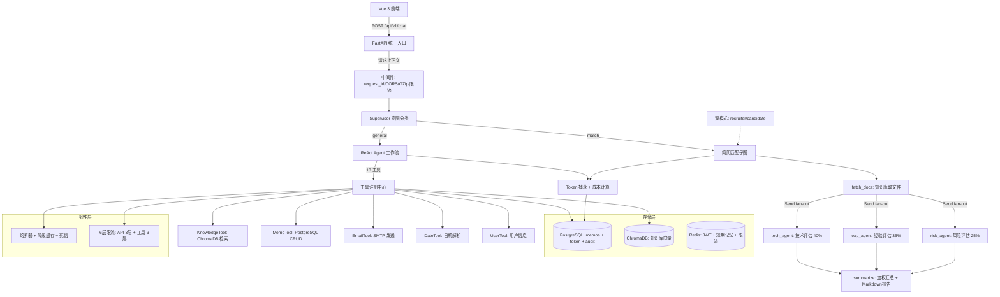

# Smart Assistant

基于 AI 大模型的个人智能助手系统，支持智能对话、知识库管理、备忘录管理、邮件发送、简历匹配评估。

---

## 架构图



---

## 核心功能

| 功能 | 说明 |
|------|------|
| **智能对话** | ReAct Agent 自主决策，17 个工具可选调用 |
| **知识库 RAG** | 6 步自适应检索流水线：查询重写→混合检索(向量+BM25)→RRF→MMR→重排→生成，组件按文档规模自动开关 |
| **备忘录管理** | 完整 CRUD + 自动分类 + 统一条件查询 + 批量删除（强制确认） |
| **邮件发送** | SMTP 发送 + HTML 格式化模板 |
| **简历匹配** | 3 Agent 并行评估（技术/经验/风险）+ 双模式视角（招聘方/候选人）+ 加权汇总报告 |
| **Token 统计** | Token 捕获 + 9 模型成本计算 + 配额保护 + 死信容错 |
| **用户管理** | 管理员可针对用户禁用/启用指定工具（黑名单持久化） |
| **工具管理** | 全局启用/禁用（持久化）+ 权限级别在线修改 + 硬拦截 |

---

## 快速启动

### 前置要求
- Docker & Docker Compose
- Python 3.13+（本地开发）
- Node.js 18+（前端）

### Docker Compose 一键启动

```bash
# 1. 配置环境变量
cp backend/.env.example backend/.env
# 编辑 backend/.env，填入 OPENAI_API_KEY

# 2. 启动所有服务
docker-compose up -d

# 3. 数据库迁移
docker-compose exec app alembic upgrade head

# 4. 验证
curl http://localhost:8000/health/live
# → {"status":"ok"}
```

服务端口：
- 后端 API：`http://localhost:8000`
- API 文档：`http://localhost:8000/docs`
- ChromaDB：`http://localhost:8001`
- PostgreSQL：`localhost:5432`
- Redis：`localhost:6379`

### 本地开发

```bash
cd backend
pip install -e ".[dev]"

# 启动服务
uvicorn src.api.main:app --reload --port 8000

# 前端
cd ../frontend
npm install
npm run dev
```

---

## API 文档

| 方法 | 路径 | 说明 |
|------|------|------|
| POST | `/api/v1/chat` | 统一对话入口（SSE 流式） |
| POST | `/api/v1/chat/mock` | 压测专用 mock 端点（模拟 SSE，不调用 LLM） |
| POST | `/api/v1/knowledge/upload` | 上传知识库文件 |
| GET | `/api/v1/knowledge/files` | 文件列表（分页） |
| DELETE | `/api/v1/knowledge/files/{name}` | 删除文件 |
| GET | `/api/v1/knowledge/retrieve` | 知识检索 + RAG |
| POST | `/api/v1/memo` | 创建备忘录 |
| GET | `/api/v1/memo/list` | 备忘录列表 |
| PUT | `/api/v1/memo/{id}` | 更新备忘录 |
| DELETE | `/api/v1/memo/{id}` | 删除备忘录 |
| GET | `/api/v1/token/records` | Token 记录 |
| GET | `/api/v1/token/statistics` | Token 统计 |
| GET | `/api/v1/token/by-model` | 按模型统计 |
| GET | `/api/v1/token/by-date` | 按日期统计 |
| GET | `/api/v1/token/quota` | 今日用量 |
| GET | `/api/v1/tools` | 工具列表 |
| PUT | `/api/v1/tools/{name}/enable` | 启用工具（持久化） |
| PUT | `/api/v1/tools/{name}/disable` | 禁用工具（持久化） |
| PUT | `/api/v1/tools/{name}/permission` | 修改工具权限级别 |
| GET | `/api/v1/tools/users/{id}/disabled` | 用户被禁工具列表 |
| POST | `/api/v1/tools/users/{id}/disable` | 对用户禁用工具 |
| POST | `/api/v1/tools/users/{id}/enable` | 取消用户工具禁用 |
| GET | `/api/v1/admin/users` | 用户列表（管理员） |
| GET | `/api/v1/chat/audit-logs` | 审计日志 |
| GET | `/api/v1/memory/sessions` | 会话记忆列表 |
| GET | `/api/v1/memory/sessions/{id}` | 会话详情 |
| DELETE | `/api/v1/memory/sessions/{id}` | 清除会话 |
| GET | `/api/v1/memory/long-term` | 长期记忆 |
| GET | `/health/live` | 存活探针 |
| GET | `/health/ready` | 就绪探针 |
| GET | `/metrics` | Prometheus 指标 |

---

## 技术栈

| 层级 | 技术 | 说明 |
|------|------|------|
| AI 框架 | LangGraph + LangChain | Agent 工作流编排 |
| LLM | 通义千问 qwen-plus | 对话 + 评估 |
| 嵌入模型 | text-embedding-v3 | 1024 维向量 |
| 向量存储 | ChromaDB | 知识库检索 |
| 数据库 | PostgreSQL + SQLAlchemy | 持久化存储 |
| Web 框架 | FastAPI + Uvicorn | 异步 API 服务 |
| 前端 | Vue 3 + Element Plus | SPA 界面 |
| 限流 | 自定义 + Redis Lua | API/工具 6 层限流 |
| 监控 | Prometheus + loguru | 指标 + 结构化日志 |
| 部署 | Docker Compose | 多服务编排 |

---

## 项目亮点

1. **ReAct 决策引擎**：18 个工具通过 12 步执行链统一管理，LLM 自主决策调用
2. **多 Agent 并行评估**：3 个 Agent Send fan-out 并行执行，加权汇总 40/35/25
3. **三层记忆体系**：Redis 短期 + PostgreSQL 长期画像 + ChromaDB 语义检索
4. **自适应 RAG 管线**：6 步检索流水线根据知识库规模自动开关组件（通过消融实验验证），小数据集延迟降 91% 精度无损
5. **企业级韧性**：熔断器、降级缓存、6 层限流、死信队列、双校验认证
6. **安全防护**：PII 脱敏（5 种）、Prompt 注入双向防御（11+3 条模式）、系统提示词泄漏检测
7. **完整可观测性**：LangFuse 链路追踪 + Prometheus 指标 + 4 级结构化日志
8. **性能验证**：RAG Hit Rate 93%、20 并发 QPS 9.6、缓存命中率 36%（详见 `tests/bench_results.md`）
